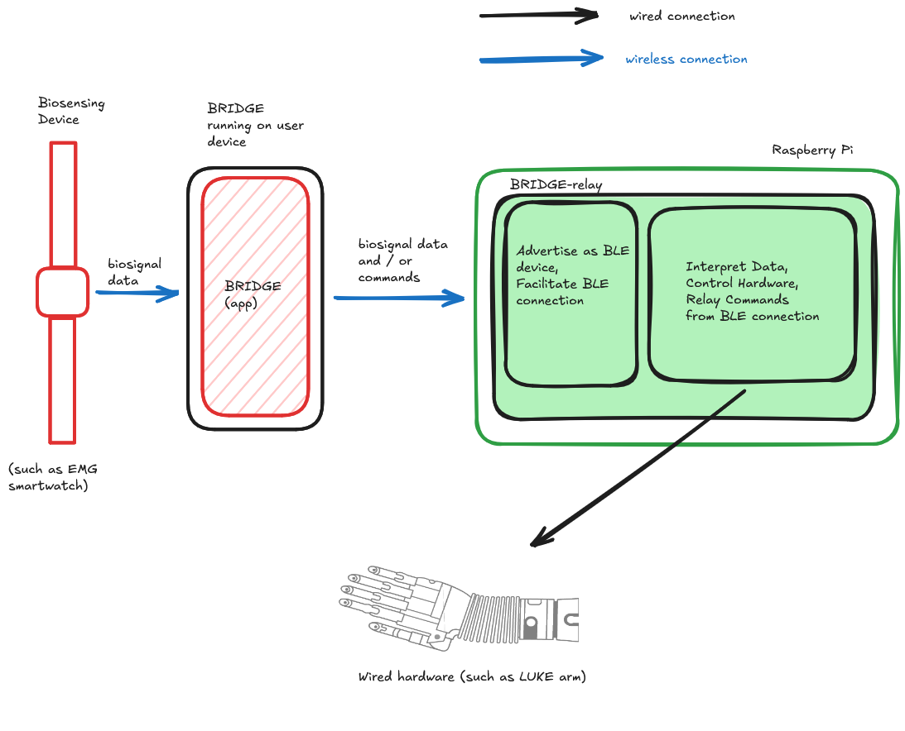

# BRIDGE-relay
Software for Universal Wireless Interface for Bionic Limbs Trainee Project

## Purpose

The BRIDGE-relay is designed to be an interface between [BRIDGE](https://leonardoferrisi.github.io/BRIDGE-docs/docs/intro) and lab hardware typically only controlled via wired connections. Such as the DEKA "Luke" Hand.

## Architecture

BRIDGE-relay is simple in its composition.

BRIDGE-relay is, in short, two programs communicating with eachother using local/internal TCP/IP connections to achieve the following:
- Advertise a device we want to control as a bluetooth device that BRIDGE can connect to
- Relay commands or data from BRIDGE (as collected in real-time from a biosensing device such as the EMG smartwatch) to the connected wired hardware (such as the Luke Hand).

 

## Technology Stack

+ Hardware
    + Raspberry Pi
    + (Optional) Bluetooth adapter
+ Software
    + Linux (likely raspbian or something lighter...)
    + Python or C++ (preferrably Python for ease-of-use)
        + Pyserial
        + BlueZ

## Development

Template code has been added to `src/`.
This is not the final software for this project and is subject to change.

## Usage

1. Connect hardware device to BRIDGE-relay
2. Turn on BRIDGE-relay
3. On the BRIDGE app, in "Connections", select the option "connect to relay" and scan for bluetooth devices.
4. Connect to the device titled "BRIDGE_relay"
5. Connect your biosensing device and begin streaming data.

### Example with EMG-smartwatch and LUKE Hand

1. Connect PCAN-USB connector from LUKE Hand to Raspberry Pi (BRIDGE-relay)
2. Turn on BRIDGE-relay
3. On the BRIDGE app, in "Connections", select the option "connect to relay" and scan for bluetooth devices.
4. Connect to the device titled "BRIDGE_relay"
5. A successful connection will return a success message along with the control software running on BRIDGE-Relay. The control software should read "DEMO-LUKE-HAND-CTRL"
5. Connect EMG smartwatch to begin streaming.
6. Grasping with the EMG smartwatch should cause the LUKE Hand to perform a grasp in real time.

## Troubleshooting

- to be added once prototype is assembled

## Current Setup

- Clone Repo
- On Raspberry Pi: One terminal should run server.py and another should run rpi_client.py
- Once those are running run PC_Client_2.py on computer
